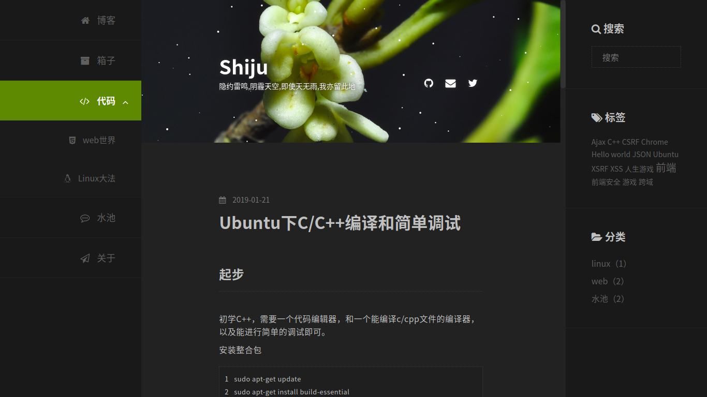

<div style="text-align: center">
    <h1><b>🏵️ Mokusei</b></h1>
    一个响应式深色三栏主题
</div>


## 介绍

桂花（Mokusei）是一个深色系的Hexo主题，它致力于打造一个安静的阅读环境。

[预览地址](https://blog.shijukun.com) 


## 界面




## 特点

* 三栏布局
* 评论系统（Disqus）
* 二级下拉导航
* 图标高程度自定义
* 社交账户设置
* 文章目录（滚动监听）
* 专注模式（隐藏边栏）
* 文章封面（提取文章第一张图片）/ 文章标题首字背景
* Javascript 粒子动画
* 多语言


## 安装

```
git clone https://github.com/shijuuu/hexo-theme-mokusei.git themes/mokusei
```

修改博客根目录下的<code>_config.yml</code>的<code>theme</code>选项为mokusei


## 更新

```
cd themes/mokusei
git pull
```


## 主题配置

| 选项        | 描述                                                         |
| ----------- | ------------------------------------------------------------ |
| name        | 站点名称（文本）用于显示顶部大图中站点信息                   |
| description | 站点描述（文本）用于显示顶部大图中站点信息                   |
| favicon     | 浏览器标题栏ICON图标（图片）相对路径/绝对路径                |
| banner      | 网站顶部大图（图片）相对路径/绝对路径                        |
| menu        | 网站导航（数组）每个数组项对应侧边栏相应的导航项，二级数组形成二级导航 |
| account     | 社交账户（数组）每个数组项为一个账户                         |


## 常见问题


#### 如何添加导航项？

修改主题配置文件<code>_config.yml</code>中的<code>menu</code>选项，该选项为一个数组，每个数组项对应侧边栏相应的导航项，二级数组形成二级导航，可自由修改，供参考栗子：

```
menu:
  首页:
    url: /
    icon: home
    iconType: fa
  归档:
    url: /archives/
    icon: archive
    iconType: fa
```

（添加社交账户同上，修改account选项）


#### 如何更改字体图标？

[Font awesome](http://www.fontawesome.com.cn/faicons/) 在这个网站内找到钟意的图标，获得它的图标class值，如<code>fa-user</code>

修改主题配置文件<code>_config.yml</code>中的<code>menu</code>或<code>account</code>内的icon选项为图标class值去掉<code>fa-</code>后的值，供参考栗子：

```
account:
  github:
    url: /
    icon: github      // 对应获得的图标class值为fa-github
    iconType: fa
```


#### 如何开启文章目录？

（文章目录获取仅出现在文章内容中含有<h1>~<h6>标签时）

编辑文章的md文件，在头部区域添加一行代码 <code>tocifs: true</code>，供参考栗子：

```
---
title: 文章标题
date: 2019-01-21 09:28:48
tocifs: true
---
```


#### 如何设置文章封面?

（如未设置文章封面，会自动将封面变为主题色绿色）

编辑文章的md文件，在头部区域添加一段代码 <code>photos:</code>，供参考栗子：

```
---
title: 文章标题
date: 2019-01-21 09:28:48
photos:
- "封面图片地址"
---
```


## 参考

参考了<code>clean-blog</code>和<code>landscape</code>主题，感谢！


## 问题反馈

[ISSUE](https://github.com/shijuuu/hexo-theme-mokusei/issues/)


